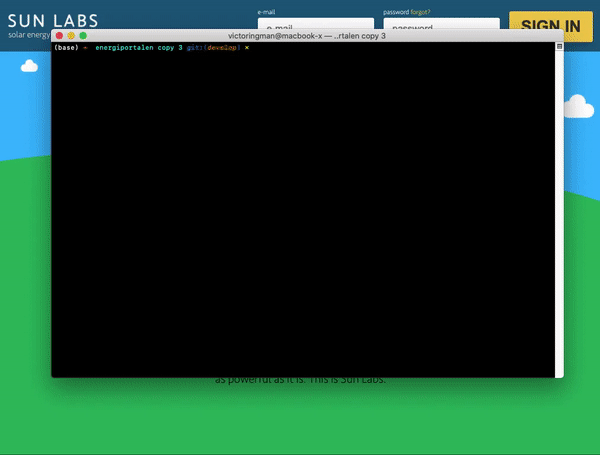

[](https://sunlabs.se)

# Energiportalen

Created 2017 as part of Bachelor Thesis in IT. Data collection, analytics and visualization for solar cell facilities.

Frontend and backend included.

## Getting Started

- Find every `TODO:` in the project and add passwords / usernames / database configuration.
- Follow `Setup Queries` in this README.
- Follow `How to run` in this README.
- Cash 

## Requirements
- MySQL installed
 - Port: 8889

## Setup Queries

Run these queries in order (manually)
```sql
    CREATE DATABASE energiportalen CHARACTER SET utf8mb4 COLLATE utf8mb4_unicode_ci;
    CREATE DATABASE energiportalen_test CHARACTER SET utf8mb4 COLLATE utf8mb4_unicode_ci;
    CREATE DATABASE energiportalen_dev CHARACTER SET utf8mb4 COLLATE utf8mb4_unicode_ci;
```

```sql
    CREATE USER 'energiportalen'@'%' IDENTIFIED BY ''; -- TODO: Set password
    CREATE USER 'wasabi'@'%' IDENTIFIED BY ''; -- TODO: Set password and username
```

```sql
    GRANT 
      ALL PRIVILEGES 
    ON 
      energiportalen.* 
    TO 
      'energiportalen'@'%';
      
    GRANT 
      ALL PRIVILEGES 
    ON 
      energiportalen_test.* 
    TO 
      'wasabi'@'%';

    GRANT 
      ALL PRIVILEGES 
    ON 
      energiportalen_dev.*
    TO 
      'wasabi'@'%';
```

*Before you run this, make sure that all the dependencies are installed (section "How to run" and "Dependencies")*

Run this in the root of the repo, will create tables and populate with dev data
```bash
npm run bootstrap
```

Next step is to import the `unit_data` CSV file!

Bravissimo, you're done!

## How to run
- `npm install` (do this in backend/ and frontend/ as well)
- `npm run start`

## Dependencies
- `npm install -g nodemon` to run and rerun javascript codes
- `npm install -g webpack` to compile es6 syntax
- `npm install -g mocha` to run frontend and backend tests
- `npm install -g create-react-app` to run and compile the frontend

## How to run tests
- `npm run test`, run frontend and backend tests
- `npm run test_be`, run backend tests
- `npm run test_fe`, run frontend tests
- `npm run test_in`, run integration tests

### Trello
https://trello.com/b/WsRPCMmn/mvp

### Drive
https://drive.google.com/open?id=0B5DXqVE7Dn66WUhFZkFFZ3hOZU0

### Overleaf
https://www.overleaf.com/8813889qmfbzphnntbn

### Other apps
* Slack
* Google Calendar
* Figma

### Fix mocha not found
`nano ~/.npmrc`
Add the following
`prefix = /usr/local`
Run
`npm install -g mocha`
